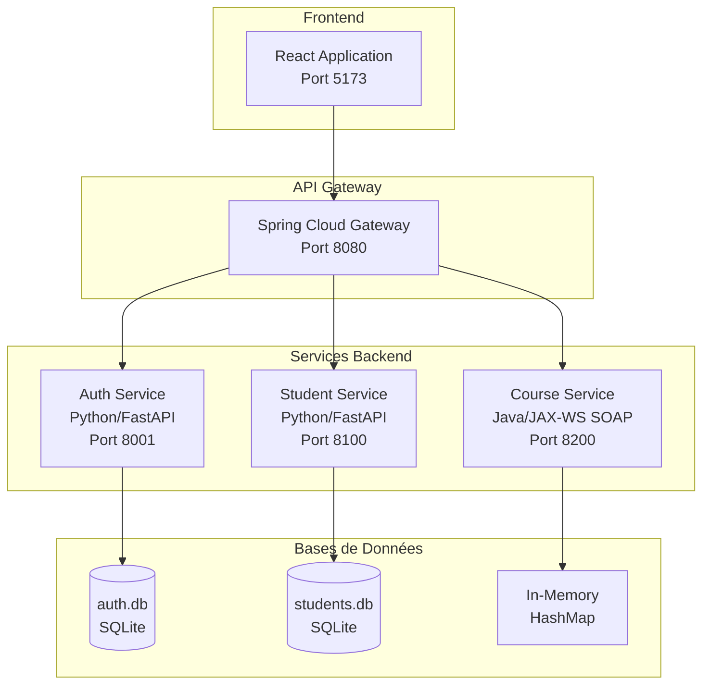

# 📊 Rapport de Projet SOA - Système de Gestion Universitaire

**Projet** : Système de Gestion Universitaire  
**Architecture** : SOA (Service-Oriented Architecture)  
**Date de rédaction** : 12 Décembre 2025  
**Version** : 1.0

---

## 📑 Table des Matières

1. [Introduction](#1-introduction)
2. [Architecture Globale](#2-architecture-globale)
3. [Services Backend](#3-services-backend)
4. [Frontend](#4-frontend)
5. [Sécurité](#5-sécurité)
6. [Base de Données](#6-base-de-données)
7. [API et Endpoints](#7-api-et-endpoints)
8. [Technologies Utilisées](#8-technologies-utilisées)
9. [Points Forts et Améliorations](#9-points-forts-et-améliorations)

---

## 1. Introduction

### 1.1 Contexte du Projet

Ce projet implémente un **Système de Gestion Universitaire** basé sur une architecture **SOA (Service-Oriented Architecture)**. L'objectif est de créer une plateforme modulaire permettant la gestion des étudiants, des cours, et des utilisateurs à travers des services indépendants et interopérables.

### 1.2 Objectifs

- ✅ Développer une architecture microservices SOA
- ✅ Implémenter des services REST et SOAP pour démontrer l'interopérabilité
- ✅ Assurer la sécurité via JWT (JSON Web Tokens)
- ✅ Créer une interface utilisateur moderne et réactive
- ✅ Centraliser le routage via une API Gateway

### 1.3 Périmètre Fonctionnel

| Module | Fonctionnalités |
|--------|-----------------|
| **Authentification** | Inscription, connexion, gestion JWT, rôles utilisateurs |
| **Étudiants** | CRUD complet, recherche, pagination, historique académique |
| **Cours** | CRUD SOAP, inscriptions, gestion des horaires |
| **Interface Web** | Dashboard, gestion centralisée, authentification |

---

## 2. Architecture Globale

### 2.1 Diagramme d'Architecture



### 2.2 Flux de Communication

| Source | Destination | Protocole | Description |
|--------|-------------|-----------|-------------|
| Frontend | API Gateway | HTTP/REST | Toutes les requêtes passent par le gateway |
| API Gateway | Auth Service | HTTP/REST | Routes `/auth/**` |
| API Gateway | Student Service | HTTP/REST | Routes `/students/**` |
| API Gateway | Course Service | SOAP/HTTP | Routes `/courses/**` et `/soap/course/**` |
| Frontend | Course Service | SOAP/XML | Communication directe SOAP via adapter |

---

## 3. Services Backend

### 3.1 Service d'Authentification (auth-service)

| Caractéristique | Valeur |
|-----------------|--------|
| **Type** | REST API |
| **Technologie** | Python 3.12 / FastAPI |
| **Port** | 8001 |
| **Base de données** | SQLite (auth.db) |

#### Fonctionnalités

| Endpoint | Méthode | Description |
|----------|---------|-------------|
| `/auth/register` | POST | Inscription d'un nouvel utilisateur |
| `/auth/login` | POST | Connexion et génération de tokens JWT |
| `/auth/refresh` | POST | Rafraîchissement du token d'accès |
| `/auth/logout` | POST | Déconnexion (blacklist du token) |
| `/auth/me` | GET | Informations de l'utilisateur connecté |
| `/auth/validate` | GET | Validation d'un token JWT |
| `/auth/users` | GET | Liste de tous les utilisateurs |

#### Modèle de Données - User

```python
class User:
    id: Integer (PK)
    email: String (unique)
    password: String (hashed avec bcrypt)
    full_name: String
    role: String  # ETUDIANT, ENSEIGNANT, ADMIN
    is_active: Integer  # 1=actif, 0=inactif
    created_at: DateTime
    updated_at: DateTime
```

#### Utilisateurs par Défaut (Seed)

| Email | Mot de passe | Rôle |
|-------|--------------|------|
| admin@university.com | admin123 | ADMIN |
| teacher@university.com | teacher123 | ENSEIGNANT |
| student@university.com | student123 | ETUDIANT |

---

### 3.2 Service Étudiants (student-service)

| Caractéristique | Valeur |
|-----------------|--------|
| **Type** | REST API |
| **Technologie** | Python 3.12 / FastAPI |
| **Port** | 8100 |
| **Base de données** | SQLite (students.db) |

#### Fonctionnalités

| Endpoint | Méthode | Description |
|----------|---------|-------------|
| `/students` | GET | Liste des étudiants (avec pagination et filtres) |
| `/students` | POST | Création d'un étudiant |
| `/students/search` | GET | Recherche par nom/matricule |
| `/students/{id}` | GET | Détails d'un étudiant |
| `/students/{id}` | PUT | Mise à jour d'un étudiant |
| `/students/{id}` | DELETE | Suppression soft d'un étudiant |
| `/students/{id}/profile` | PATCH | Mise à jour partielle du profil |
| `/students/{id}/history` | GET | Historique académique |
| `/students/{id}/history` | POST | Ajouter un enregistrement historique |

#### Modèle de Données - Student

```python
class Student:
    id: Integer (PK)
    fullname: String
    nom: String
    prenom: String
    email: String (unique)
    age: Integer
    matricule: String (unique)
    dateNaissance: Date
    telephone: String
    adresse: String
    filiere: String  # INFO, SCI, etc.
    niveau: String   # L1, L2, L3, M1, M2
    anneeInscription: Integer
    photo: String    # URL
    statut: String   # ACTIF, SUSPENDU, DIPLOME
    deleted_at: DateTime  # Soft delete
```

#### Modèle de Données - AcademicHistory

```python
class AcademicHistory:
    id: Integer (PK)
    student_id: Integer (FK)
    annee: Integer
    details: String
    created_at: DateTime
```

---

### 3.3 Service Cours (course-service)

| Caractéristique | Valeur |
|-----------------|--------|
| **Type** | SOAP Web Service |
| **Technologie** | Java / JAX-WS |
| **Port** | 8200 |
| **Stockage** | In-Memory (HashMap) |
| **WSDL** | `http://localhost:8200/course-service?wsdl` |

#### Opérations SOAP Disponibles (12 méthodes)

##### Gestion des Cours

| Opération | Description |
|-----------|-------------|
| `getCourse(id)` | Récupérer un cours par ID |
| `getAllCourses()` | Liste de tous les cours |
| `addCourse(...)` | Créer un nouveau cours |
| `updateCourse(...)` | Mettre à jour un cours |
| `deleteCourse(id)` | Supprimer un cours |
| `listCoursesFiltered(...)` | Filtrer les cours |

##### Gestion des Inscriptions

| Opération | Description |
|-----------|-------------|
| `enrollStudent(courseId, studentId)` | Inscrire un étudiant à un cours |
| `getEnrolledStudents(courseId)` | Liste des étudiants inscrits |
| `unenrollStudent(courseId, studentId)` | Désinscrire un étudiant |

##### Gestion des Horaires

| Opération | Description |
|-----------|-------------|
| `addSchedule(...)` | Ajouter un horaire (avec détection de conflits) |
| `getSchedules(courseId)` | Liste des horaires d'un cours |
| `deleteSchedule(scheduleId)` | Supprimer un horaire |

#### Modèle de Données - Course

```java
class Course {
    int id;
    String code;        // ex: "CS101"
    String name;        // ex: "Mathématiques"
    String description;
    int credits;
    int hours;
    String filiere;     // SCI, INFO, etc.
    String niveau;      // L1, L2, etc.
    Integer enseignantId;
    String salle;
}
```

#### Modèle de Données - Schedule

```java
class Schedule {
    int scheduleId;
    int courseId;
    String dayOfWeek;   // Monday, Tuesday, etc.
    String startTime;   // HH:mm
    String endTime;     // HH:mm
    String room;
}
```

---

### 3.4 API Gateway

| Caractéristique | Valeur |
|-----------------|--------|
| **Technologie** | Spring Boot / Spring Cloud Gateway |
| **Port** | 8080 |
| **Rôle** | Routage centralisé, CORS, proxy |

#### Configuration des Routes

| Route ID | URI Source | URI Destination |
|----------|------------|-----------------|
| auth-service | `/auth/**` | `http://auth-service:8001` |
| student-service | `/students/**` | `http://student-service:8100` |
| course-service-rest | `/courses/**` | `http://course-service:8200` |
| course-service-soap | `/soap/course/**` | `http://course-service:8200` |

#### Configuration CORS

```yaml
globalcors:
  corsConfigurations:
    '[/**]':
      allowedOrigins: "*"
      allowedMethods: GET, POST, PUT, DELETE, OPTIONS
      allowedHeaders: "*"
```

---

## 4. Frontend

### 4.1 Caractéristiques Générales

| Caractéristique | Valeur |
|-----------------|--------|
| **Framework** | React 18 |
| **Bundler** | Vite |
| **Routing** | React Router DOM |
| **State Management** | Context API |
| **Styling** | CSS personnalisé |
| **Port Dev** | 5173 |

### 4.2 Structure des Composants

```
frontend/src/
├── App.jsx                    # Point d'entrée avec routing
├── main.jsx                   # Bootstrap React
├── index.css                  # Styles globaux
├── context/
│   └── AuthContext.jsx        # Gestion de l'authentification
├── components/
│   ├── Auth/
│   │   ├── Login.jsx          # Page de connexion
│   │   └── Register.jsx       # Page d'inscription
│   ├── Layout/
│   │   ├── Dashboard.jsx      # Tableau de bord
│   │   ├── Navbar.jsx         # Barre de navigation
│   │   └── Sidebar.jsx        # Menu latéral
│   ├── Students/
│   │   └── StudentList.jsx    # Gestion des étudiants
│   ├── Courses/
│   │   ├── CourseList.jsx     # Liste des cours
│   │   └── CourseForm.jsx     # Formulaire cours
│   ├── Users/
│   │   └── UserList.jsx       # Gestion des utilisateurs
│   └── Common/
│       └── Loading.jsx        # Composant de chargement
└── services/
    ├── api.js                 # Configuration Axios
    ├── authService.js         # Appels auth API
    ├── studentService.js      # Appels students API
    ├── courseService.js       # Appels courses REST
    └── soapCourseService.js   # Client SOAP pour courses
```

### 4.3 Routes de l'Application

| Route | Composant | Protection | Description |
|-------|-----------|------------|-------------|
| `/login` | Login | ❌ Public | Page de connexion |
| `/register` | Register | ❌ Public | Page d'inscription |
| `/dashboard` | Dashboard | ✅ Protégée | Tableau de bord |
| `/students` | StudentList | ✅ Protégée | Gestion étudiants |
| `/courses` | CourseList | ✅ Protégée | Gestion cours |
| `/users` | UserList | ✅ Protégée | Gestion utilisateurs |

### 4.4 Mécanisme de Protection des Routes

```jsx
const ProtectedRoute = ({ children }) => {
  const { isAuthenticated, loading } = useAuth();
  
  if (loading) return <Loading />;
  if (!isAuthenticated) return <Navigate to="/login" />;
  
  return children;
};
```

---

## 5. Sécurité

### 5.1 Authentification JWT

#### Configuration

| Paramètre | Valeur | Configurable via |
|-----------|--------|------------------|
| **Algorithme** | HS256 | `AUTH_JWT_ALGO` |
| **Secret Key** | CHANGE_ME_SECRET | `AUTH_JWT_SECRET` |
| **Access Token Expiration** | 15 minutes | `AUTH_ACCESS_EXPIRE_MINUTES` |
| **Refresh Token Expiration** | 7 jours | `AUTH_REFRESH_EXPIRE_DAYS` |

#### Structure du Token JWT

```json
{
  "sub": "user_id",
  "role": "ETUDIANT|ENSEIGNANT|ADMIN",
  "type": "access|refresh",
  "exp": "expiration_timestamp"
}
```

### 5.2 Hachage des Mots de Passe

- **Algorithme** : bcrypt
- **Salt** : Généré automatiquement par bcrypt
- **Stockage** : Hash encodé en UTF-8

### 5.3 Validation des Mots de Passe

Règles de complexité appliquées lors de l'inscription :

| Règle | Exigence |
|-------|----------|
| Longueur minimale | 8 caractères |
| Majuscule | Au moins 1 |
| Minuscule | Au moins 1 |
| Chiffre | Au moins 1 |
| Symbole | Au moins 1 |

### 5.4 Mécanisme de Blacklist

Le service d'authentification maintient une blacklist en mémoire pour les tokens révoqués lors du logout :

```python
_blacklist = set()

def add_to_blacklist(token: str):
    _blacklist.add(token)

def is_blacklisted(token: str) -> bool:
    return token in _blacklist
```

### 5.5 Récapitulatif de Sécurité par Service

| Service | Auth | Autorisation | HTTPS |
|---------|------|--------------|-------|
| auth-service | ✅ JWT + bcrypt | ⚠️ Rôles basiques | ❌ HTTP |
| student-service | ❌ Via Gateway | ❌ Non | ❌ HTTP |
| course-service | ❌ Via Gateway | ❌ Non | ❌ HTTP |
| api-gateway | ⚠️ Peut valider | ❌ Non | ❌ HTTP |

---

## 6. Base de Données

### 6.1 Schéma - auth.db (SQLite)

```sql
CREATE TABLE users (
    id INTEGER PRIMARY KEY AUTOINCREMENT,
    email TEXT UNIQUE NOT NULL,
    password TEXT NOT NULL,
    full_name TEXT,
    role TEXT DEFAULT 'ETUDIANT',
    is_active INTEGER DEFAULT 1,
    created_at TIMESTAMP DEFAULT CURRENT_TIMESTAMP,
    updated_at TIMESTAMP DEFAULT CURRENT_TIMESTAMP
);
```

### 6.2 Schéma - students.db (SQLite)

```sql
CREATE TABLE students (
    id INTEGER PRIMARY KEY AUTOINCREMENT,
    fullname TEXT,
    nom TEXT,
    prenom TEXT,
    email TEXT UNIQUE NOT NULL,
    age INTEGER,
    matricule TEXT UNIQUE NOT NULL,
    dateNaissance DATE,
    telephone TEXT,
    adresse TEXT,
    filiere TEXT,
    niveau TEXT,
    anneeInscription INTEGER,
    photo TEXT,
    statut TEXT DEFAULT 'ACTIF',
    deleted_at TIMESTAMP
);

CREATE TABLE academic_history (
    id INTEGER PRIMARY KEY AUTOINCREMENT,
    student_id INTEGER,
    annee INTEGER,
    details TEXT,
    created_at TIMESTAMP
);
```

### 6.3 Stockage - Course Service (In-Memory)

```java
private static final Map<Integer, Course> courses = new HashMap<>();
private static final Map<Integer, Set<Integer>> enrollments = new HashMap<>();
private static final Map<Integer, Schedule> schedules = new HashMap<>();
```

---

## 7. API et Endpoints

### 7.1 Résumé des Endpoints REST

#### Auth Service (Port 8001)

| Méthode | Endpoint | Auth Required |
|---------|----------|---------------|
| POST | `/auth/register` | ❌ |
| POST | `/auth/login` | ❌ |
| POST | `/auth/refresh` | ✅ Bearer Token |
| POST | `/auth/logout` | ✅ Bearer Token |
| GET | `/auth/me` | ✅ Bearer Token |
| GET | `/auth/validate` | ✅ Bearer Token |
| GET | `/auth/users` | ❌ |
| GET | `/health` | ❌ |

#### Student Service (Port 8100)

| Méthode | Endpoint | Auth Required |
|---------|----------|---------------|
| GET | `/students` | ❌ |
| POST | `/students` | ❌ |
| GET | `/students/search?q=` | ❌ |
| GET | `/students/{id}` | ❌ |
| PUT | `/students/{id}` | ❌ |
| DELETE | `/students/{id}` | ❌ |
| PATCH | `/students/{id}/profile` | ❌ |
| GET | `/students/{id}/history` | ❌ |
| POST | `/students/{id}/history` | ❌ |
| DELETE | `/students/{id}/history/{hid}` | ❌ |

### 7.2 Opérations SOAP (Port 8200)

WSDL disponible à : `http://localhost:8200/course-service?wsdl`

```xml
<soapenv:Envelope xmlns:soapenv="http://schemas.xmlsoap.org/soap/envelope/"
                  xmlns:cour="http://course.university.com/">
   <soapenv:Body>
      <cour:getAllCourses/>
   </soapenv:Body>
</soapenv:Envelope>
```

---

## 8. Technologies Utilisées

### 8.1 Backend

| Composant | Technologie | Version |
|-----------|-------------|---------|
| Auth Service | Python + FastAPI | 3.12 / 0.122 |
| Student Service | Python + FastAPI | 3.12 / 0.122 |
| Course Service | Java + JAX-WS | 11+ |
| API Gateway | Spring Boot + Spring Cloud Gateway | 3.x |
| ORM Python | SQLAlchemy | 2.x |
| JWT Library | python-jose | Latest |
| Password Hashing | bcrypt | Latest |

### 8.2 Frontend

| Composant | Technologie | Version |
|-----------|-------------|---------|
| Framework | React | 18.x |
| Bundler | Vite | 5.x |
| Routing | React Router DOM | 6.x |
| HTTP Client | Axios | Latest |
| Styling | CSS | - |

### 8.3 Bases de Données

| Service | Type | Technologie |
|---------|------|-------------|
| Auth Service | Relationnel | SQLite |
| Student Service | Relationnel | SQLite |
| Course Service | In-Memory | Java HashMap |

---

## 9. Points Forts et Améliorations

### 9.1 Points Forts ✅

1. **Architecture SOA complète** avec séparation claire des responsabilités
2. **Interopérabilité** REST et SOAP démontrée
3. **Sécurité JWT** avec tokens access/refresh
4. **Hachage bcrypt** pour les mots de passe
5. **Validation robuste** des données utilisateur
6. **API Gateway centralisée** avec Spring Cloud
7. **Frontend React moderne** avec routes protégées
8. **Soft delete** pour les étudiants (préservation des données)
9. **Pagination et filtres** sur les listes
10. **Détection de conflits d'horaires** dans le service cours

### 9.2 Améliorations Recommandées ⚠️

| Priorité | Amélioration | Impact |
|----------|--------------|--------|
| 🔴 Haute | Changer `AUTH_JWT_SECRET` en production | Sécurité critique |
| 🔴 Haute | Implémenter HTTPS/TLS | Sécurité transport |
| 🟠 Moyenne | Persister la blacklist des tokens | Fiabilité |
| 🟠 Moyenne | Vérification des rôles au niveau Gateway | Autorisation |
| 🟠 Moyenne | Migrer Course Service vers BD persistante | Perte de données |
| 🟡 Basse | Rate limiting sur les endpoints | Protection DDoS |
| 🟡 Basse | Logging centralisé | Monitoring |
| 🟡 Basse | Tests unitaires et d'intégration | Qualité code |

### 9.3 Services Manquants (selon ANALYSE_PROJET.md)

| Service | Type | Priorité |
|---------|------|----------|
| Service Notes | REST / Python FastAPI | 🔴 Critique |
| Service Facturation | SOAP / .NET ou Java | 🔴 Critique |

---

## 📎 Annexes

### Démarrage des Services

```bash
# Auth Service
cd services/auth-service
source venv/bin/activate
python run.py

# Student Service
cd services/student-service
source venv/bin/activate
python run.py

# Course Service
cd services/course-service
java -cp "lib/*:." com.university.course.CoursePublisher

# API Gateway
cd services/api-gateway
./mvnw spring-boot:run

# Frontend
cd frontend
npm install
npm run dev
```

### Ports Récapitulatifs

| Service | Port |
|---------|------|
| Frontend (Vite) | 5173 |
| API Gateway | 8080 |
| Auth Service | 8001 |
| Student Service | 8100 |
| Course Service (SOAP) | 8200 |

---

**Fin du Rapport**

*Document généré automatiquement - Projet SOA Gestion Universitaire*
