# 📐 Conception UML - Système de Gestion Universitaire SOA

**Projet** : Architecture SOA - Gestion Universitaire  
**Date** : 09/12/2025  
**Version** : 1.0

---

## 📋 Table des Matières
CODE ISO: GSA-FR-04-00                                                                                 Semestre II : 2024 -2025

1. [Diagramme de Composants](#1-diagramme-de-composants)
2. [Diagrammes de Classes](#2-diagrammes-de-classes)
3. [Diagrammes de Séquence](#3-diagrammes-de-séquence)
4. [Diagramme de Déploiement](#4-diagramme-de-déploiement)
5. [Diagramme de Cas d'Utilisation](#5-diagramme-de-cas-dutilisation)

---

## 1. Diagramme de Composants

### Architecture SOA Globale

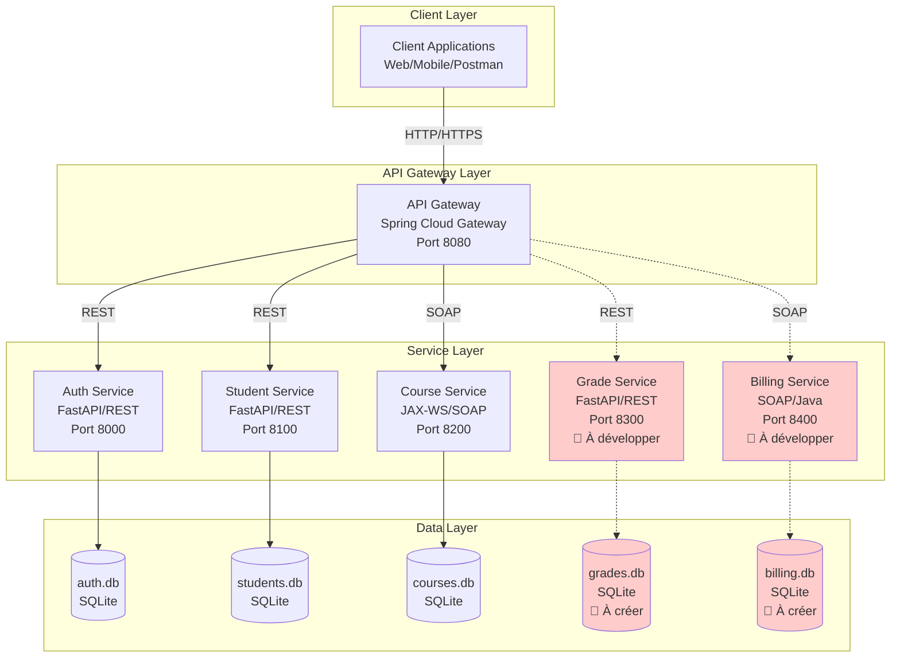

### Légende
- ✅ **Ligne continue** : Composant implémenté
- 🔴 **Ligne pointillée** : Composant à développer

---

## 2. Diagrammes de Classes

### 2.1 Service Authentification (auth-service)

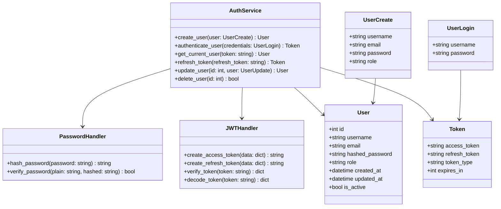

### 2.2 Service Étudiants (student-service)

```mermaid
classDiagram
    class Student {
        +int id
        +string matricule
        +string nom
        +string prenom
        +string email
        +string telephone
        +date date_naissance
        +string filiere
        +int niveau
        +datetime created_at
        +datetime updated_at
    }
    
    class StudentCreate {
        +string matricule
        +string nom
        +string prenom
        +string email
        +string telephone
        +date date_naissance
        +string filiere
        +int niveau
    }
    
    class StudentUpdate {
        +string nom
        +string prenom
        +string email
        +string telephone
        +string filiere
        +int niveau
    }
    
    class StudentService {
        +create_student(student: StudentCreate) Student
        +get_student(id: int) Student
        +get_student_by_matricule(matricule: string) Student
        +get_all_students() List~Student~
        +get_students_by_filiere(filiere: string) List~Student~
        +update_student(id: int, student: StudentUpdate) Student
        +delete_student(id: int) bool
    }
    
    class StudentRepository {
        +save(student: Student) Student
        +find_by_id(id: int) Student
        +find_by_matricule(matricule: string) Student
        +find_all() List~Student~
        +update(student: Student) Student
        +delete(id: int) bool
    }
    
    StudentService --> Student
    StudentService --> StudentRepository
    StudentCreate --> Student
    StudentUpdate --> Student
    StudentRepository --> Student
```

### 2.3 Service Cours (course-service)

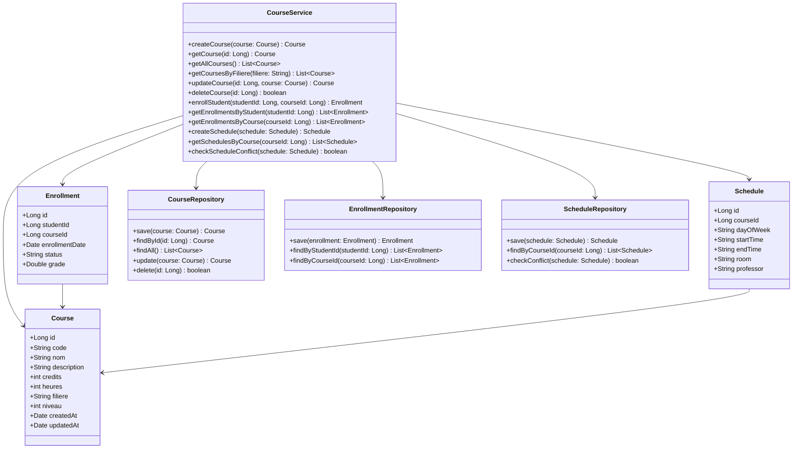

### 2.4 Service Notes (grade-service) - À Développer

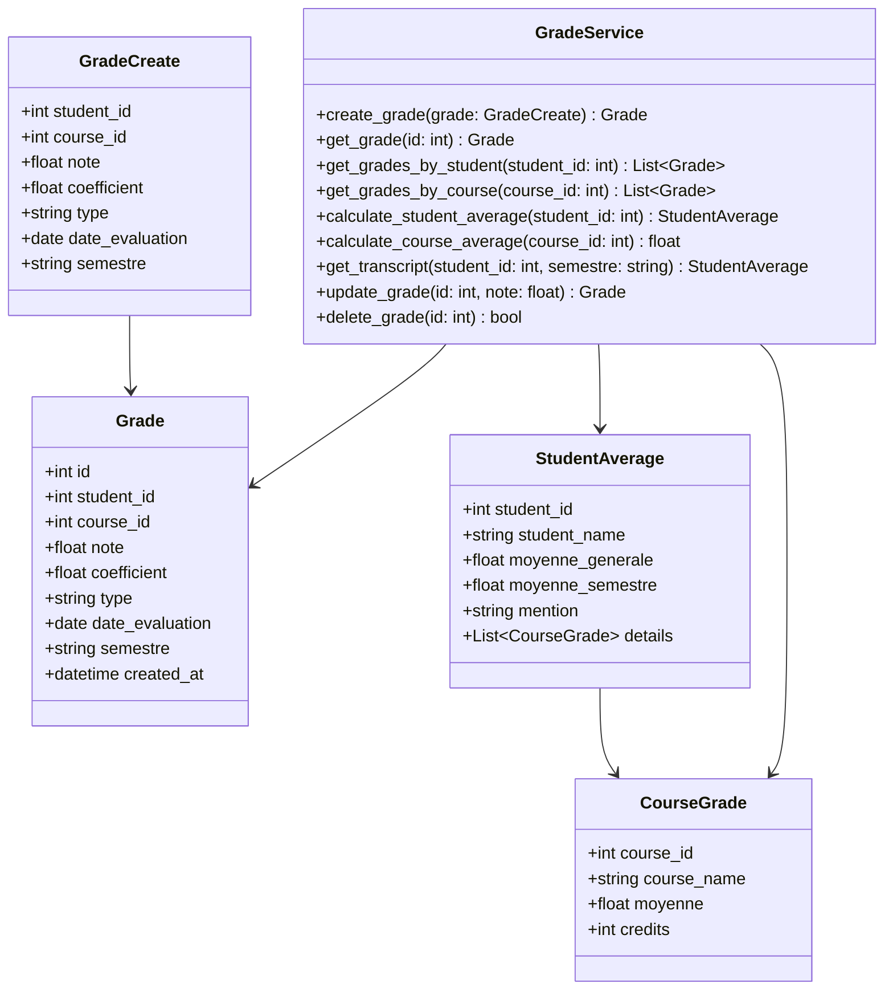

### 2.5 Service Facturation (billing-service) - À Développer

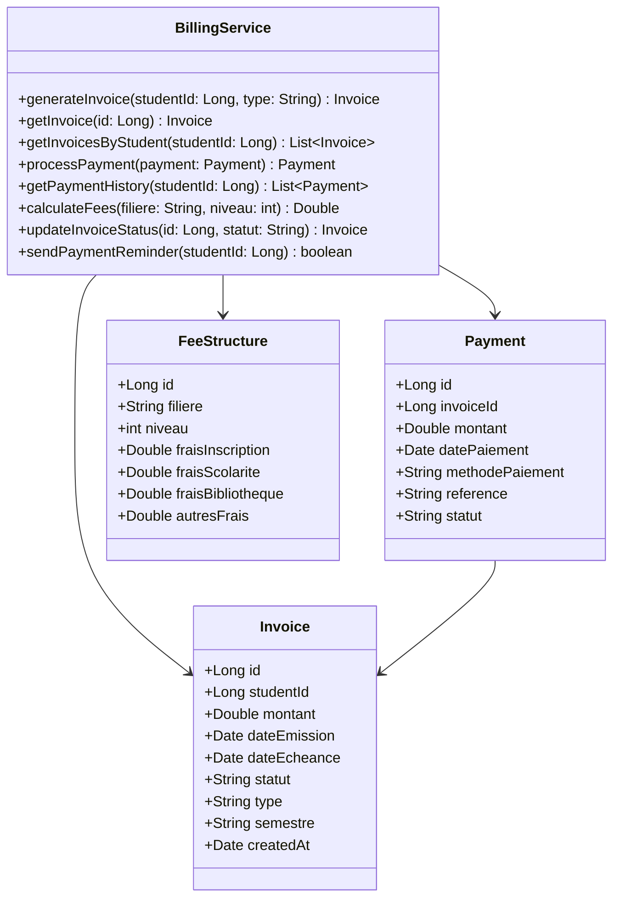

---

## 3. Diagrammes de Séquence

### 3.1 Authentification et Accès Sécurisé

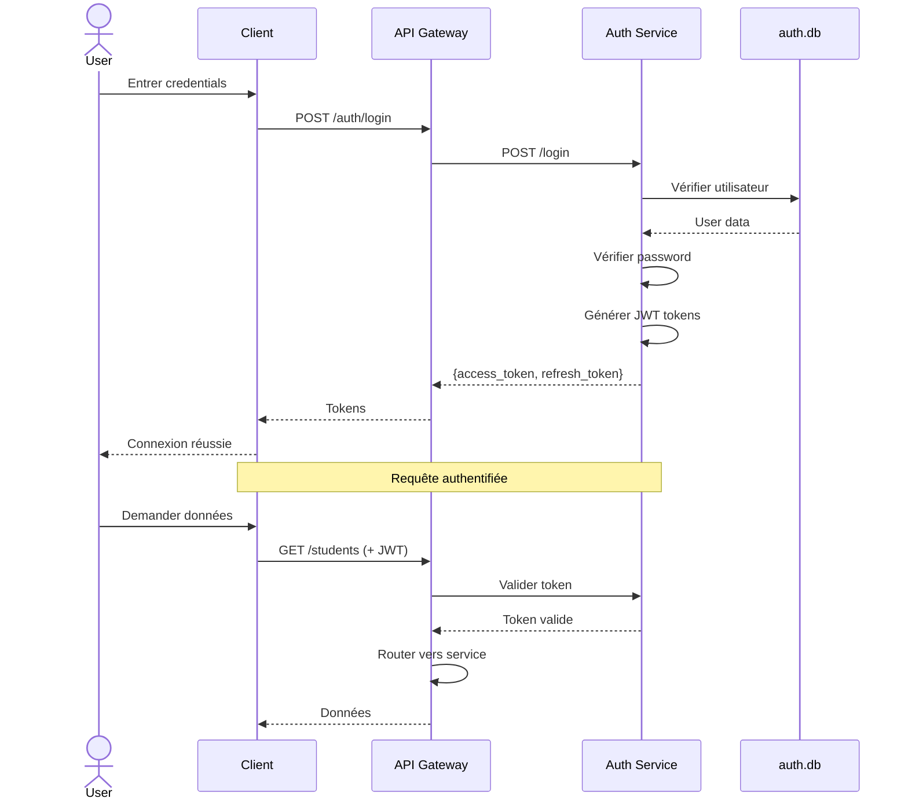

### 3.2 Inscription d'un Étudiant à un Cours

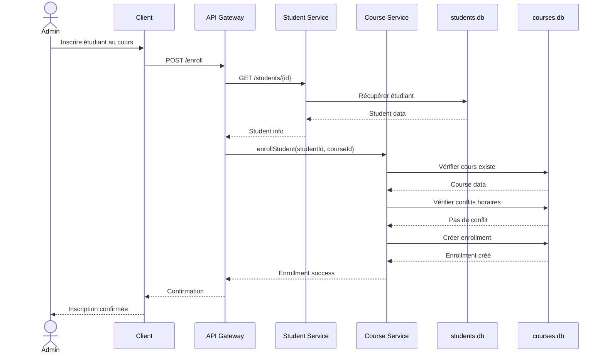

### 3.3 Calcul de Moyenne (avec Service Notes)

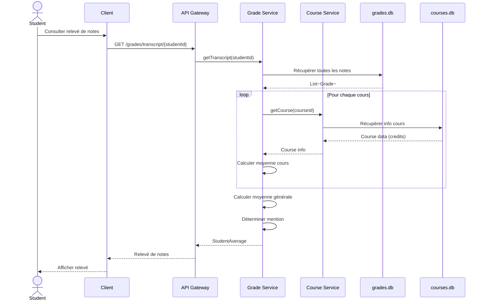

### 3.4 Génération et Paiement de Facture

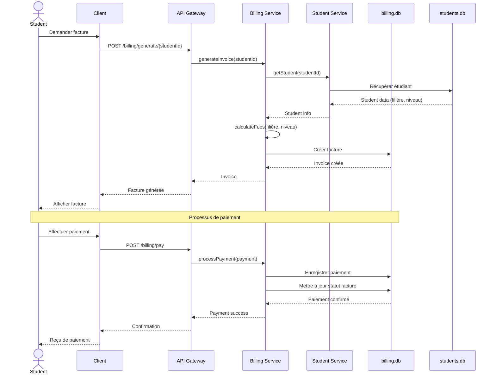

---

## 4. Diagramme de Déploiement

### Architecture Docker

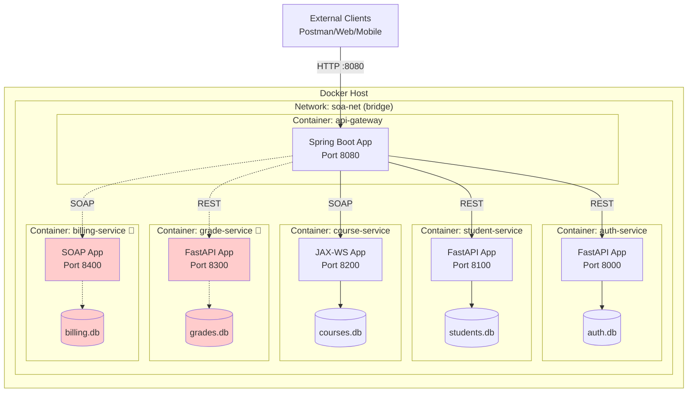

### Configuration Docker Compose

| Service | Image | Port Mapping | Volumes | Dépendances |
|---------|-------|--------------|---------|-------------|
| **api-gateway** | Custom (Spring Boot) | 8080:8080 | - | auth, student, course |
| **auth-service** | Custom (Python:3.11) | 8000:8000 | ./auth.db | - |
| **student-service** | Custom (Python:3.11) | 8100:8100 | ./students.db | - |
| **course-service** | Custom (OpenJDK:17) | 8200:8200 | ./courses.db | - |
| **grade-service** 🔴 | Custom (Python:3.11) | 8300:8300 | ./grades.db | - |
| **billing-service** 🔴 | Custom (OpenJDK:17) | 8400:8400 | ./billing.db | - |

---

## 5. Diagramme de Cas d'Utilisation

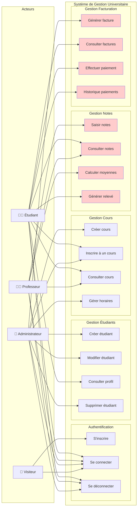

### Description des Cas d'Utilisation

#### Authentification
- **UC1 - S'inscrire** : Créer un compte utilisateur
- **UC2 - Se connecter** : Authentification avec JWT
- **UC3 - Se déconnecter** : Invalider le token

#### Gestion Étudiants
- **UC4 - Créer étudiant** : Ajouter un nouvel étudiant
- **UC5 - Modifier étudiant** : Mettre à jour les informations
- **UC6 - Consulter profil** : Voir ses informations personnelles
- **UC7 - Supprimer étudiant** : Retirer un étudiant du système

#### Gestion Cours
- **UC8 - Créer cours** : Ajouter un nouveau cours
- **UC9 - Inscrire à un cours** : Inscription étudiant/cours
- **UC10 - Consulter cours** : Voir les cours disponibles
- **UC11 - Gérer horaires** : Planifier les séances

#### Gestion Notes 🔴
- **UC12 - Saisir notes** : Enregistrer les notes des étudiants
- **UC13 - Consulter notes** : Voir ses notes
- **UC14 - Calculer moyennes** : Calcul automatique des moyennes
- **UC15 - Générer relevé** : Créer un relevé de notes

#### Gestion Facturation 🔴
- **UC16 - Générer facture** : Créer une facture pour un étudiant
- **UC17 - Consulter factures** : Voir ses factures
- **UC18 - Effectuer paiement** : Payer une facture
- **UC19 - Historique paiements** : Consulter l'historique

---

## 📊 Matrice de Traçabilité

| Cas d'Utilisation | Service(s) Impliqué(s) | Statut |
|-------------------|------------------------|--------|
| UC1-UC3 | Auth Service | ✅ Implémenté |
| UC4-UC7 | Student Service | ✅ Implémenté |
| UC8-UC11 | Course Service | ✅ Implémenté |
| UC12-UC15 | Grade Service + Course + Student | 🔴 À développer |
| UC16-UC19 | Billing Service + Student | 🔴 À développer |

---

## 🔗 Interactions entre Services

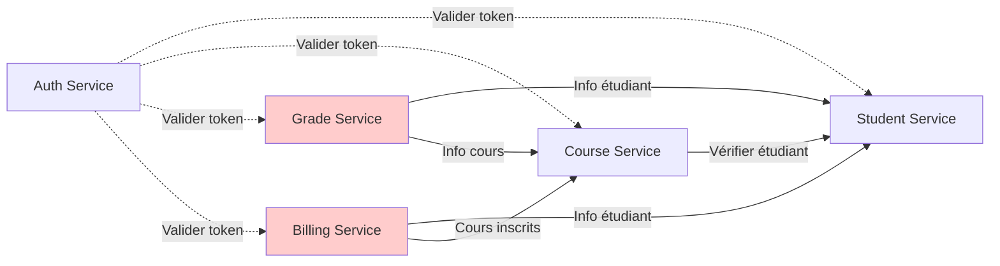

---

## 📝 Notes de Conception

### Principes Architecturaux

1. **Séparation des Responsabilités**
   - Chaque service gère un domaine métier spécifique
   - Base de données dédiée par service (Database per Service pattern)

2. **Communication**
   - REST pour les services Python (FastAPI)
   - SOAP pour les services Java (JAX-WS)
   - API Gateway comme point d'entrée unique

3. **Sécurité**
   - Authentification centralisée (Auth Service)
   - JWT pour la gestion des sessions
   - Validation des tokens à chaque requête

4. **Scalabilité**
   - Services indépendants et déployables séparément
   - Conteneurisation Docker
   - Network bridge pour l'isolation

### Technologies par Service

| Service | Langage | Framework | Base de Données | Protocole |
|---------|---------|-----------|-----------------|-----------|
| Auth | Python 3.11 | FastAPI | SQLite | REST |
| Student | Python 3.11 | FastAPI | SQLite | REST |
| Course | Java 17 | JAX-WS | SQLite | SOAP |
| Grade 🔴 | Python 3.11 | FastAPI | SQLite | REST |
| Billing 🔴 | Java 17 | JAX-WS | SQLite | SOAP |
| Gateway | Java 17 | Spring Cloud | - | HTTP |

---

## 🎯 Prochaines Étapes

1. ✅ **Conception UML** - Terminée
2. 🔴 **Développer Grade Service** - Priorité 1
3. 🔴 **Développer Billing Service** - Priorité 2
4. 🔴 **Compléter la documentation** - En cours
5. 🔴 **Tests d'intégration** - À planifier

---

**Document créé par** : Antigravity AI  
**Dernière mise à jour** : 09/12/2025
